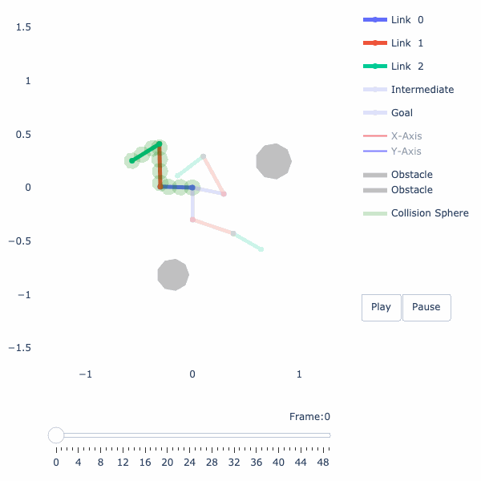
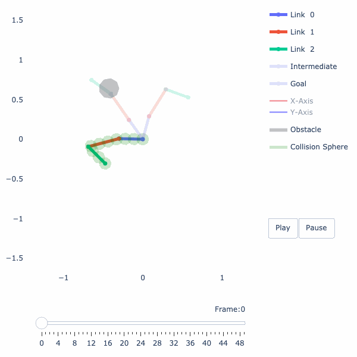
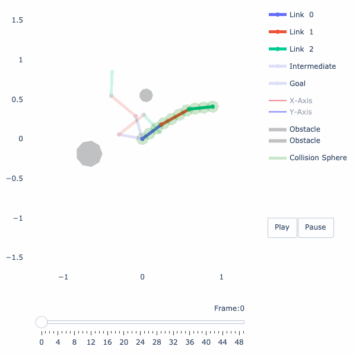
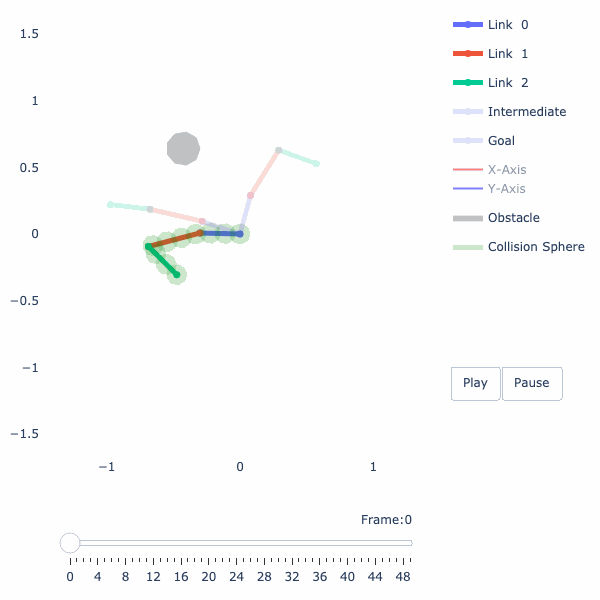
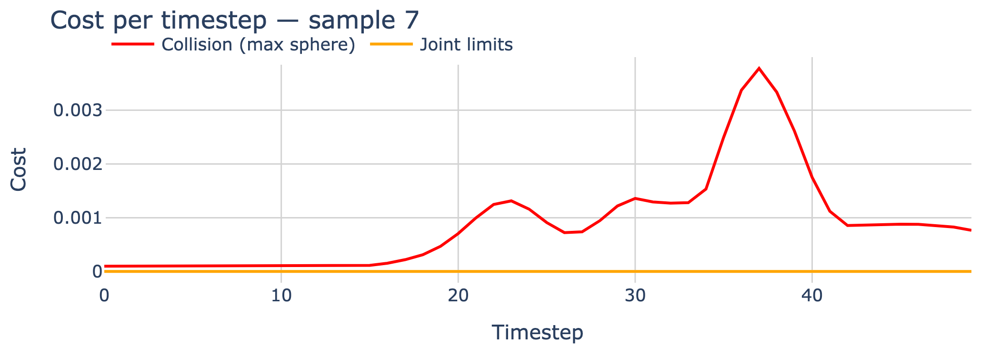
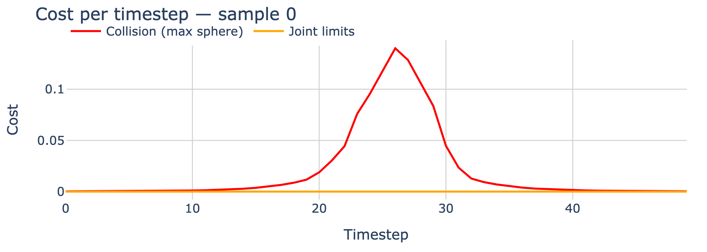

# Warm-Starting Trajectory Optimization with Self-Supervised Learning

> **Self-supervised neural warm-start for robot motion planning** — a learned initializer that predicts near-feasible trajectories for a 3-DOF planar arm, enabling faster and more reliable gradient-based optimization.


---

## Demo

<table>
  <tr>
    <td align="center"><b>Trained warm-start trajectory</b></td>
    <td align="center"><b>Baseline (zero output / straight line)</b></td>
  </tr>
  <tr>
    <td></td>
    <td></td>
  </tr>
</table>

<table>
  <tr>
    <td align="center"><b>Multi-obstacle environment</b></td>
    <td align="center"><b>Tunneling failure (before fix)</b></td>
  </tr>
  <tr>
    <td></td>
    <td></td>
  </tr>
</table>

---

## Overview

Trajectory optimization is the backbone of motion planning for robotic arms: given a start and goal configuration, find a smooth, collision-free path. In practice, gradient-based optimizers are sensitive to initialization — a poor warm-start may converge to a local minimum that passes through obstacles, or require many iterations to escape.

This project addresses the warm-starting problem with a **self-supervised neural network** that predicts a near-feasible trajectory directly from the task description (start/goal joint angles) and a signed distance field (SDF) of the environment. The key insight is that the network does not require any labeled trajectory dataset: it is trained end-to-end against the same differentiable cost functions used by the optimizer itself.

**The result**: a planner that generalizes across obstacle layouts and task configurations, routing around obstacles without a single expert demonstration.

---

## Method

### Pipeline

```
  q_start, q_goal          SDF map (128×128)
       │                          │
       ▼                          ▼
 StateEncoder (MLP)        EnvEncoder (CNN)
   64-dim latent             64-dim latent
       │                          │
       └──────────┬───────────────┘
                  ▼
          WaypointDecoder (MLP)
        C−2 interior waypoints
                  │
      (prepend q_start, append q_goal)
                  ▼
      B-Spline Interpolation (T=50 steps)
                  │
     Differentiable Cost Functions
      (collision · limits · smoothness)
                  │
                  ▼
           Loss → Backprop
```

### Trajectory Representation

Trajectories are parameterized as **cubic B-splines**: the network predicts `C = 10` control points in joint space (the 8 interior waypoints, with start/goal fixed), and the full `T = 50`-step trajectory is evaluated via the Cox–de Boor recursion. This continuous representation provides smooth gradients through the entire trajectory and prevents the optimizer from creating jerky, discontinuous paths.

### Self-Supervised Training

No reference trajectories are used. The model is trained by minimizing a composite differentiable cost over the predicted B-spline:

| Cost term | Description |
|---|---|
| **Collision** | Three-zone penalty (inside / danger zone / safe) + exponential repulsion; CCD inflation prevents tunneling |
| **Joint limits** | Quadratic penalty for joint angle violations |
| **Smoothness** | Penalizes squared joint velocities and accelerations |
| **Waypoint spacing** | Penalizes unequal spacing between consecutive control points (discourages rushing through obstacles) |
| **Exploration** | Anti-local-minimum term that encourages larger deviations from the straight line when the path is in collision |

The robot body is approximated by a set of **spheres** placed along each link. Forward kinematics is implemented in PyTorch so that gradients flow from sphere world positions back through joint angles into the network weights. Sphere-to-obstacle distances are computed via **bilinear interpolation** on the SDF grid — fully differentiable.

### Environment Encoding

Environments consist of randomly sampled circular obstacles placed within the robot's reachable workspace. Each environment is rasterized into a **128×128 signed distance field** (grid extent 2.5 m). The CNN encoder compresses this map into a 64-dimensional latent vector. Optionally, the environment encoder and a state autoencoder can be **pre-trained independently** before end-to-end training of the full planner.

---

## Technical Features

- **B-spline trajectory parameterization** with cubic Cox–de Boor basis and clamped endpoints
- **CNN environment encoder** compressing 128×128 SDF maps to 64-d latent vectors
- **MLP state encoder** encoding `[q_start, q_goal, FK_start, FK_goal]` to 64-d
- **Zero-initialized decoder** — warm-start at epoch 0 is a straight-line interpolation (stable baseline)
- **Differentiable sphere-based collision model** with CCD and joint-position weighting
- **Exploration cost** that breaks the "barely-outside-obstacle" local minimum
- **Pre-training support** for environment and state autoencoders
- **Procedural dataset generation** with non-trivial pair filtering (straight path blocked)
- **Interactive Jupyter browsers** for datasets and predicted trajectories
- **GIF export** of trajectory animations via Plotly + Kaleido + Pillow
- **Adam + ExponentialLR** training schedule

---

## Results

The model is trained self-supervised on procedurally generated environments with 1–4 circular obstacles. Training converges reliably; validation loss tracks training loss closely, indicating good generalization.

**Qualitative results** (from `src/resources/`):

| Asset | Description |
|---|---|
| `val_trajectories_working_trajectory_7.gif` | Predicted trajectory on a held-out validation sample |
| `overfit_64_10_2obs_working_trajectory_16.gif` | Two-obstacle environment — arm routes around both obstacles |
| `tunnel_trajectory.gif_trajectory_0.gif` | Early training failure — arm tunnels through an obstacle (problem subsequently fixed with CCD and exploration cost) |
| `zero_output_trajectory_0.gif` | Baseline (network output = 0, i.e., straight-line interpolation) — collides |
| `val_trajectories_working_cost_7.png` | Per-timestep collision and joint-limit costs after training |
| `zero_output_cost_0.png` | Per-timestep costs for the straight-line baseline |

<table>
  <tr>
    <td align="center"><b>Trained — cost profile</b></td>
    <td align="center"><b>Baseline — cost profile</b></td>
  </tr>
  <tr>
    <td></td>
    <td></td>
  </tr>
</table>

---

## Repository Structure

```
Self-Supervised-Learning-for-Robot-Motion-Planning/
│
├── src/
│   ├── models.py                    # WarmStartPlanner, EnvEncoder, StateEncoder,
│   │                                #   WaypointDecoder, autoencoders, B-spline utilities
│   ├── losses.py                    # Differentiable cost functions (collision, smoothness,
│   │                                #   joint limits, spacing, exploration)
│   ├── training.py                  # train(), train_env_autoencoder(), train_state_autoencoder()
│   ├── data.py                      # SDF generation, dataset assembly, dataset browser
│   ├── utils.py                     # Forward kinematics, sphere FK, differentiable SDF query
│   ├── visualization.py             # browse_trajectories(), save_viewer_as_gif()
│   │
│   ├── train.ipynb                  # End-to-end training pipeline
│   ├── test.ipynb                   # Evaluation, visualization, trajectory browser
│   ├── create_training_data.ipynb   # Procedural dataset generation
│   ├── process_nvidia_1_sample.ipynb # Single-sample overfitting experiment
│   │
│   ├── models/                      # Saved model weights (.pt)
│   ├── data/                        # Generated datasets (.pt)
│   └── resources/                   # Output GIFs and cost plots
│
├── external/
│   └── SimpleArm/                   # Git submodule — 2D planar arm simulator
│
├── requirements.txt
└── README.md
```

---

## Installation

### Requirements

- **Python 3.11** (recommended)
- **Git** with submodule support

### Setup

```bash
# 1. Clone with submodule
git clone --recurse-submodules https://github.com/mangam-02/Self-Supervised-Learning-for-Robot-Motion-Planning.git
cd Self-Supervised-Learning-for-Robot-Motion-Planning

# 2. Create virtual environment
python3.11 -m venv .venv

# 3. Activate
source .venv/bin/activate          # macOS / Linux
# .venv\Scripts\activate           # Windows CMD
# .venv\Scripts\Activate.ps1       # Windows PowerShell

# 4. Install dependencies
pip install -r requirements.txt
```

If you cloned without `--recurse-submodules`, initialize the `SimpleArm` submodule manually:

```bash
git submodule update --init --recursive
```

#### Platform-specific Python 3.11 installation

**macOS (Homebrew)**
```bash
brew install python@3.11
```

**Ubuntu / Debian**
```bash
sudo apt update && sudo apt install python3.11 python3.11-venv python3.11-dev
```

**Windows** — download the installer from [python.org](https://www.python.org/downloads/release/python-3110/) and check *Add Python to PATH*.

### Deactivating

```bash
deactivate
```

### Troubleshooting

| Problem | Fix |
|---|---|
| `python3.11: command not found` | `brew link python@3.11 --force` (macOS) or use `python3` |
| Permission denied on activate | `chmod +x .venv/bin/activate` |
| `pip install` fails | `pip install --upgrade pip && pip cache purge` |

---

## Usage

All entry points are Jupyter notebooks under `src/`. Activate your virtual environment first, then launch Jupyter:

```bash
source .venv/bin/activate
jupyter notebook src/
```

### 1 — Generate a dataset

Open `src/create_training_data.ipynb`. It calls `data.generate_dataset()`, which:
- Samples random circular obstacle environments
- Builds 128×128 SDF tensors
- Samples non-trivial `(q_start, q_goal)` pairs (straight-line path blocked)
- Saves train / val / test splits to `src/data/`

```python
from data import generate_dataset
dataset = generate_dataset(
    N_envs=200, pairs_per_env=5,
    save_path="data/dataset.pt",
    split=(0.75, 0.125, 0.125),
)
```

### 2 — Train the planner

Open `src/train.ipynb`. The notebook trains the `WarmStartPlanner` end-to-end:

```python
from training import train
model, history = train(
    train_dataset="data/dataset_train.pt",
    val_dataset="data/dataset_val.pt",
    n_epochs=2000,
    batch_size=32,
    save_path="models/warm_start_planner.pt",
)
```

Optional: pre-train the environment and state autoencoders before end-to-end training:

```python
from training import train_env_autoencoder, train_state_autoencoder

train_env_autoencoder("data/sdf_dataset.pt", ...)
train_state_autoencoder(linklengths=[0.4, 0.3, 0.2], ...)
```

### 3 — Evaluate and visualize

Open `src/test.ipynb`. It loads a trained model and launches an interactive browser:

```python
from visualization import browse_trajectories
browse_trajectories(
    model="models/warm_start_planner.pt",
    dataset="data/dataset_val.pt",
    animate=True,
    save_name="val_result",
)
```

Use **Next ►** / **◄ Prev** buttons to navigate samples. Click **💾 Save** to export the current trajectory as a GIF and the cost profile as a PNG to `src/resources/`.

---

## Implementation Details

| Component | Choice | Rationale |
|---|---|---|
| Trajectory parametrization | Cubic B-spline (C=10, T=50) | Smooth gradients, fewer parameters than raw waypoints |
| Collision model | Sphere decomposition + SDF bilinear interpolation | Differentiable, GPU-compatible |
| CCD | Danger-zone inflation by half travel distance | Prevents tunneling through thin obstacles |
| Encoder depth | 3-layer CNN (16→32→64) + AdaptiveAvgPool | Compact, fast; SDF is smooth |
| State features | `[q, fk(q)]` for start and goal | Exposes Cartesian geometry to the MLP |
| Decoder init | Zero weights on output layer | Training starts from straight-line baseline |
| Optimizer | Adam, lr=1e-3, ExponentialLR γ=0.9995 | Smooth decay avoids late-stage oscillations |
| Framework | PyTorch 2.x | Autograd through FK, SDF sampling, and B-spline evaluation |

---

## Future Work

- **Higher-DOF robots** — extend to 6- or 7-DOF serial chains and SE(3) task spaces
- **3D environments** — replace 2D SDF grids with voxel grids or neural implicit representations
- **Dynamic obstacles** — condition the encoder on time-varying obstacle states
- **Optimization refinement stage** — chain the network with a gradient-based optimizer (e.g., GPMP2, TrajOpt) initialized at the predicted warm-start
- **Sim-to-real transfer** — deploy on physical hardware using learned domain adaptation
- **Learned cost weights** — meta-learn the loss weighting for faster adaptation to new environments

---

## References

1. Schulman, J. et al. **Motion Planning with Sequential Convex Optimization and Convex Collision Checking.** IJRR, 2014.
2. Mukadam, M. et al. **Continuous-time Gaussian Process Motion Planning via Probabilistic Inference.** IJRR, 2018.
3. Ratliff, N. et al. **CHOMP: Covariant Hamiltonian Optimization for Motion Planning.** ICRA, 2009.
4. Ha, J. et al. **Learning Sparse Waypoint Representations for Motion Planning.** CoRL, 2022.

---

*Course project — **Advanced Deep Learning for Robotics** (SS26), Prof. Berthold Bäuml, Technical University of Munich (TUM).*
