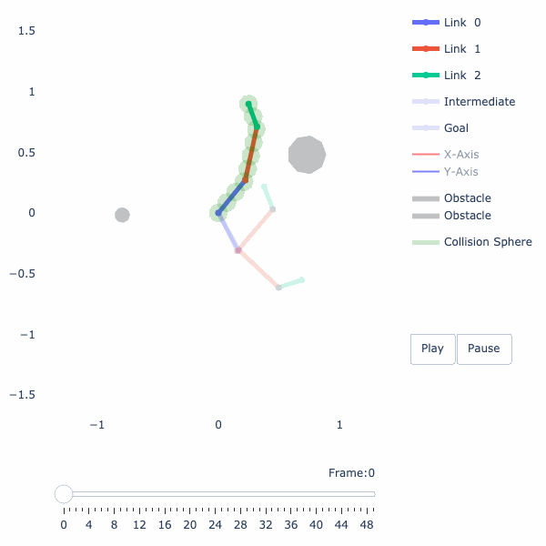
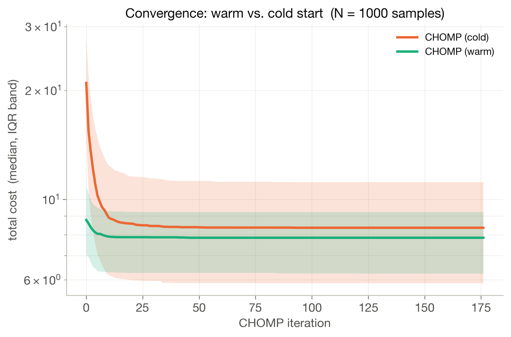
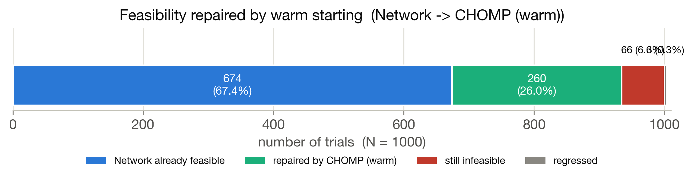
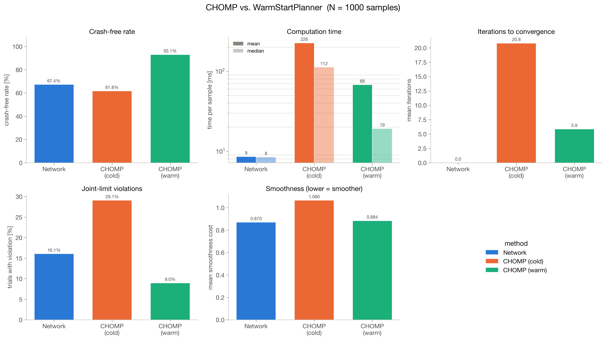

# Warm-Starting Trajectory Optimization with Self-Supervised Learning

> **Neural warm-starts for robot motion planning. No labeled trajectories needed.**


**A neural network predicts a near-feasible trajectory in ~8 ms; CHOMP then refines it to feasibility.
On 1000 held-out planning problems this reaches a 97.6% collision-free rate at 35 ms/sample, versus
71.9% at 145 ms/sample for the same optimizer started cold.**

---

## Demo

The same planning problem, solved three ways. The network alone is fast but still clips the obstacle;
CHOMP from a cold start takes many iterations; the network's output handed to CHOMP converges in a
few iterations to a clean path.

<table>
  <tr>
    <td align="center"><b>Network only (~8 ms)</b></td>
    <td align="center"><b>CHOMP from scratch</b></td>
    <td align="center"><b>Network &rarr; CHOMP (warm)</b></td>
  </tr>
  <tr>
    <td></td>
    <td></td>
    <td></td>
  </tr>
</table>

<table>
  <tr>
    <td align="center"><b>Multi-obstacle environment</b></td>
    <td align="center"><b>Baseline: zero output (straight line)</b></td>
  </tr>
  <tr>
    <td></td>
    <td></td>
  </tr>
</table>

---

## Overview

Trajectory optimization is a fundamental tool in robot motion planning: given start and goal joint configurations, find a smooth, collision-free path through the workspace. Gradient-based optimizers (CHOMP, TrajOpt, GPMP2) are reliable and expressive, but they are **highly sensitive to initialization**. A straight-line warm-start almost always intersects obstacles, forcing the optimizer to spend many iterations escaping infeasible regions or converging to a local minimum that still collides.

**The core tradeoff:**

| Approach | Speed | Reliability | Requires |
|---|---|---|---|
| Classical optimization (cold start) | Slow | Medium | Good initialization |
| Pure learning-based | Fast | Low at distribution shift | Large labeled dataset |
| **This project (learned warm start + CHOMP)** | **Fast** | **High** | **No labeled data** |

This project trains a **self-supervised warm-start predictor**: a neural network that maps (start config, goal config, obstacle SDF) directly to a near-feasible joint-space trajectory, optimized entirely against differentiable planning costs. No expert demonstrations, no labeled trajectory datasets.

At inference the predicted B-spline trajectory is handed to a **CHOMP optimizer built from the exact same differentiable cost terms**, which refines it to a collision-free solution in a handful of iterations.

---

## Project Status

Both stages are implemented, and the full pipeline has been benchmarked against a cold-start baseline
over 1000 held-out planning problems.

| Component | Status |
|---|---|
| Procedural dataset generation (circular obstacles, non-trivial pair sampling) | ✅ Done |
| Procedural dataset generation (organic blob shapes, `data_shapes.py`) | ✅ Done |
| Environment autoencoder pre-training | ✅ Done |
| State autoencoder pre-training | ✅ Done |
| Self-supervised end-to-end training (`WarmStartPlanner`) | ✅ Done |
| Differentiable cost functions (collision, limits, smoothness, spacing, exploration) | ✅ Done |
| CHOMP optimizer with covariant updates + line search (`chomp.py`) | ✅ Done |
| Weight-independent trajectory metrics (`evaluation.py`) | ✅ Done |
| Quantitative benchmark: network vs. cold CHOMP vs. warm CHOMP (1000 trials) | ✅ Done |
| Trajectory visualization, GIF export, report figures | ✅ Done |
| Higher-DOF robots / 3D environments | 🚧 Future work |

---

## Method

### Pipeline

```
  Start/Goal Config + Obstacle Environment (SDF)
                       |
                       v
          +------------------------+
          |  Neural Warm-Start     |   ~8 ms, no optimization
          |  Predictor             |
          +------------------------+
                       |
                       v
          Near-feasible trajectory
          (cubic B-spline, T=50 steps)
                       |
                       v
          +------------------------+
          |  CHOMP Refinement      |   ~3-6 iterations
          |  (same cost terms)     |
          +------------------------+
                       |
                       v
          Collision-free trajectory
```

### Neural Architecture

```
  q_start, q_goal  (2 x 3)              SDF map (1 x 128 x 128)
        |                                        |
        v                                        v
  state features [q_s, q_g, FK_s, FK_g]    EnvEncoder
  22-d                                     ResNet-18 backbone
        |                                  (conv1 -> 1 channel)
        v                                  avgpool -> fc 512->64
  StateEncoder (MLP 22-128-128-12)               |
        |                                        |
        +-------------------+--------------------+
                            |  concat -> 76-d
                            v
                  WaypointDecoder (MLP 76-256-256-24)
                  zero-initialized output layer
                            |
                            v
                  offsets for C-2 = 8 interior waypoints
                            |
                  + linear interpolation baseline
                  prepend q_start · append q_goal
                            |
                            v
              waypoints [B, C=10, dof=3]
                            |
              B-spline matrix M [T=50, C=10]
                            |
                            v
              trajectory [B, T=50, dof=3]
                            |
              Differentiable Cost Functions
               collision · limits · smoothness
               spacing · exploration
                            |
                            v
                     Loss -> Backprop
```

**Environment encoder.** A **ResNet-18** (`torchvision`, no pretrained weights) whose first
convolution is replaced by a single-channel `7x7/2` conv so it consumes the raw `[1, 128, 128]` SDF
directly. The classifier head is dropped; global average pooling feeds a linear `512 -> 64` layer.
The residual backbone was needed because the earlier shallow CNN could not resolve narrow passages
between obstacles.

**State encoder.** A 3-layer MLP mapping the 22-d feature vector
`[q_start, q_goal, FK(q_start), FK(q_goal)]` to a **12-d** latent. Forward kinematics contributes
`(dof+1) x 2 = 8` values per configuration, exposing the Cartesian geometry the SDF latent is
expressed in. The deliberately tight latent keeps the environment code (64-d) dominant in the
concatenation, so the decoder conditions primarily on obstacle layout.

**Waypoint decoder.** An MLP over the concatenated `64 + 12 = 76`-d code, predicting
`(C-2) x dof = 24` values. Crucially it predicts **offsets from a straight-line baseline**, not
absolute waypoints:

```python
baseline = q_start + t * (q_goal - q_start)      # t = linspace(0,1,C)[1:-1]
inner    = baseline + offset                      # network output
waypoints = [q_start, inner…, q_goal]
```

The output layer is **zero-initialized**, so an untrained model reproduces the straight-line
interpolation exactly and training starts from a sensible baseline rather than random noise.
Endpoints are concatenated, never predicted, so start and goal are satisfied by construction.

**Pre-training.** `EnvAutoEncoder` pairs the ResNet encoder with a transposed-conv decoder
(`fc -> 256x4x4`, five upsampling blocks back to `128x128`) and is trained on 20 000 SDF maps.
`StateAutoEncoder` reconstructs the 22-d feature vector through the same 12-d bottleneck, trained on
240 000 sampled configuration pairs. Both encoders were then loaded and **frozen** for the
end-to-end run, so the self-supervised trajectory loss only shapes the decoder.

### Trajectory Representation

Trajectories are parameterized as **cubic B-splines**: the network predicts `C = 10` control points in joint space (8 interior waypoints; start and goal are fixed), and the full `T = 50`-step trajectory is evaluated via the Cox-de Boor recursion. This continuous representation provides smooth gradients and prevents discontinuous paths.

### Self-Supervised Training

No reference trajectories are used. The model is trained by minimizing a composite differentiable cost over the predicted B-spline:

| Cost term | Description |
|---|---|
| **Collision** | Three-zone penalty (inside / danger zone / safe) plus exponential repulsion; CCD inflation prevents tunneling through thin obstacles |
| **Joint limits** | Quadratic penalty for joint angle violations |
| **Smoothness** | Penalizes squared joint velocities and accelerations |
| **Waypoint spacing** | Penalizes unequal spacing between consecutive control points to discourage rushing through obstacles |
| **Exploration** | Anti-local-minimum term that encourages larger deviations from the straight line when the path is in collision |

The robot body is approximated by a set of **spheres** placed along each link. Forward kinematics is implemented in PyTorch so gradients flow from sphere world positions back through joint angles into the network weights. Sphere-to-obstacle distances are computed via **bilinear interpolation** on the SDF grid, making the entire pipeline end-to-end differentiable.

### CHOMP Refinement

`chomp.py` implements CHOMP (Covariant Hamiltonian Optimization for Motion Planning) on top of the
**same** `losses.py` terms the network is trained on, so the learned and classical stages pursue an
identical objective. It minimizes

```
U(ξ) = collision(ξ) + joint_limits(ξ) + smoothness(ξ)
```

over a dense trajectory `ξ ∈ [B, T, dof]` with the *covariant* update

```
ξ_{k+1} = ξ_k - (1/η) * A⁻¹ ∇U(ξ_k),      A = KᵀK   (K = second-difference operator)
```

so a change at one waypoint is spread smoothly over its neighbours. Start and goal are pinned; the
metric and the update act on interior waypoints only.

Implementation notes that mattered in practice:

- **Backtracking line search.** A fixed `1/η` step overshoots on this stiff cost (a strong collision weight over a narrow `eps` band) and can leave a warm-started trajectory *worse* than it began. The step is halved until the cost actually decreases, making the descent monotone. `η` therefore caps the largest step considered, not the step taken.
- **Convergence-based stopping**, not a fixed iteration count: collision-free (sphere surfaces clear), cost plateau, or `max_iters`. This is what makes wall-clock time a meaningful quantity to compare.
- **`collision_agg="sum"`** for optimization. Training aggregates with `max` (worst timestep only), which carries gradient through a single waypoint and stalls a trajectory optimizer.
- **Warm starts** accept either a dense trajectory or the model's control points, which are lifted through the same clamped B-spline matrix the model uses (cached per `C`, because rebuilding it costs ~75 ms and dwarfed the optimization itself).

---

## Results

Two models were benchmarked, each on **1000 held-out test problems** from its own distribution:

- **Run A, circular obstacles** (`wsp_general_0907_v1`): 1-3 small circles, links `[0.3, 0.4, 0.3]`.
- **Run B, organic blob obstacles** (`wsp_general_shapes_1707_v1`): 2-4 large irregular blobs, links `[0.35, 0.45, 0.2]`. Substantially harder: more of the workspace is occupied and passages are narrower.

Five methods per run. Every CHOMP variant is given the corresponding model's own training loss
weights, and all methods are scored by the same weight-independent feasibility criterion (see
[Methodology](#benchmark-methodology)).

### Headline numbers

**Run A: circular obstacles**

| Method | Collision-free | Mean iters | ms / sample |
|---|---|---|---|
| Network only | 86.3 % | n/a | **9.1** |
| CHOMP (cold) | 71.9 % | 14.6 | 144.6 |
| **Network → CHOMP (warm)** | **97.6 %** | **3.1** | 35.0 |
| CHOMP (cold, +extra losses) | 71.6 % | 15.9 | 272.9 |
| Network → CHOMP (warm, +extra) | 97.6 % | 3.1 | 52.3 |

**Run B: organic blob obstacles**

| Method | Collision-free | Mean iters | ms / sample |
|---|---|---|---|
| Network only | 67.4 % | n/a | **8.2** |
| CHOMP (cold) | 61.8 % | 20.8 | 220.9 |
| **Network → CHOMP (warm)** | **93.1 %** | **5.9** | 66.6 |
| CHOMP (cold, +extra losses) | 58.3 % | 25.4 | 476.5 |
| Network → CHOMP (warm, +extra) | 93.3 % | 6.0 | 112.4 |

<table>
  <tr>
    <td align="center"><b>Speed vs. feasibility (Run B)</b></td>
    <td align="center"><b>Convergence: warm vs. cold</b></td>
  </tr>
  <tr>
    <td></td>
    <td></td>
  </tr>
</table>

The tradeoff plot is the whole result in one picture: the warm-started pipeline sits **top-left**, the only method that is simultaneously fast and reliable. Cold CHOMP sits bottom-right: it pays an
order of magnitude more time to end up *less* feasible than the network alone.

### Warm starting beats cold starting on both axes at once

This is the non-obvious part. Warm starting does not trade accuracy for speed, it wins both:

| | Run A | Run B |
|---|---|---|
| Feasibility gain over cold CHOMP | 71.9 % → **97.6 %** (+25.7 pts) | 61.8 % → **93.1 %** (+31.3 pts) |
| Speedup over cold CHOMP | 144.6 → **35.0 ms** (4.1×) | 220.9 → **66.6 ms** (3.3×) |
| Iterations to converge | 14.6 → **3.1** | 20.8 → **5.9** |

The network is not adding work to the optimizer; it is *removing* it. And the effect grows with
problem difficulty: the harder blob distribution shows both the larger feasibility gain and the
larger absolute time saving.

### Where the gain actually comes from

The averages hide a strongly bimodal distribution, so the per-sample breakdown matters more than the
mean. Splitting the 1000 trials by whether the **network alone** already solved them:

| | Run A | Run B |
|---|---|---|
| Network already collision-free | 863 | 674 |
| → warm CHOMP median iters / time | 1 iter, 16.9 ms | 1 iter, 17.4 ms |
| Network in collision | 137 | 326 |
| → **repaired** by warm CHOMP | **118 (86.1 %)** | **260 (79.8 %)** |
| → repaired by cold CHOMP on the same subset | 80 (58.4 %) | 140 (42.9 %) |
| → warm CHOMP median iters / time | 6 iters, 49.5 ms | 6 iters, 60.4 ms |
| Regressions (network OK → warm CHOMP collides) | 5 | 3 |
| Remaining infeasible | 19 (1.9 %) | 66 (6.6 %) |

Two things follow:

1. **The median warm run takes 1 iteration.** For the majority of problems CHOMP verifies at its
   first check that the network output is already collision-free and returns it unchanged. This is
   why the *mean* iteration count (3.1 / 5.9) must not be read as "CHOMP always does a little work". It does nothing at all
   most of the time, and real work on the minority that needs it.
2. **On exactly the hard subset, the warm start is decisive.** Restricted to the problems the network
   failed, warm CHOMP repairs 86 % / 80 % where cold CHOMP manages 58 % / 43 %, with the same
   optimizer, the same weights and the same time budget, differing only in initialization. The
   initialization is doing the work, not the optimizer.

<table>
  <tr>
    <td align="center"><b>Waterfall: solved · repaired · remaining (Run B)</b></td>
    <td align="center"><b>Summary grid (Run B)</b></td>
  </tr>
  <tr>
    <td></td>
    <td></td>
  </tr>
</table>

### Cold CHOMP is worse than the network alone

On both distributions the classical optimizer started from a straight line ends up *below* a single
forward pass (71.9 % vs. 86.3 %; 61.8 % vs. 67.4 %) while costing 16-27x the time. It converges into
colliding local minima, precisely the failure mode the warm start is meant to avoid. Its solutions
are also worse-behaved where it does succeed:

| Metric (Run A) | Network | CHOMP (cold) | CHOMP (warm) |
|---|---|---|---|
| Trials violating joint limits | 27 | 152 | 25 |
| Max joint violation | **0.20 rad** | 4.19 rad | 2.91 rad |
| Mean min. clearance | 0.090 | 0.037 | 0.074 |
| Max smoothness cost | **3.01** | 9.96 | 3.74 |

The joint-limit column is the clearest signal: cold CHOMP violates limits on 15 % of trials and by up
to 4.19 rad, because escaping a collision from a bad initialization means swinging the arm far. The
network never learned to do that (its worst violation is 0.20 rad), and warm-starting inherits that
well-behavedness.

### The "+extra losses" variants do not pay off

Adding the exploration and waypoint-spacing terms to CHOMP (the terms the *network* was also trained
on) is roughly neutral on feasibility (97.6 % → 97.6 %, 93.1 % → 93.3 %) while costing 1.5-2.2x the
time. Worse, on a cold start they destabilize the search badly: `max_smooth` rises to **37.1** (Run A)
and **89.7** (Run B), versus ~3.7 warm-started. These terms earn their place during training, where
they break the "barely-outside-obstacle" local minimum over thousands of epochs, but as
per-problem search aids in an optimizer they mostly buy wall-clock time.

### Tail behaviour

Mean times understate the spread, which matters if the planner has a deadline:

| Run B | median | p95 | max |
|---|---|---|---|
| Network | 8.1 ms | 8.5 ms | 36.4 ms |
| CHOMP (cold) | 109.6 ms | 646.8 ms | 1848 ms |
| CHOMP (warm) | 18.5 ms | 332.5 ms | 1766 ms |

The network is not just fast on average, it is *predictable*, a fixed-cost forward pass with almost
no tail. Warm-started CHOMP retains a heavy tail on the hard minority, which is where the remaining
6.6 % of Run B failures live.

### Honest caveats

- **Timings are CPU, single sample at a time** (`device="cpu"`, B=1), so they measure per-problem latency, not throughput. Batched GPU inference would widen the network's advantage further.
- **Warm CHOMP occasionally regresses a good trajectory** (5 and 3 trials). The line search guarantees monotone *cost* descent, but cost and geometric feasibility are not the same objective: a cheaper trajectory can be marginally in collision.
- **Run A and Run B use different robots and obstacle distributions** and are not directly comparable to each other; only the methods within a run are.
- **The remaining infeasible trials are not analyzed.** Whether the 6.6 % in Run B are genuine narrow-passage problems or dataset artifacts (start/goal pairs sampled too close to obstacles) is open.

Full figure sets (crash-free rate, computation time, iterations, joint violations, smoothness,
per-metric distributions, convergence curves, tradeoff, waterfall and crash-free-rate vs. obstacle
count) are exported as vector PDF + 300-dpi PNG to `src/resources/results_general_0907_v1/` and
`src/resources/results_general_shapes_1707_v1/`, alongside `summary.csv` and a `results.pkl` from
which every figure can be regenerated without re-running CHOMP.

### Benchmark methodology

Two choices keep the comparison honest:

1. **CHOMP is given the loaded model's own loss weights**, not `chomp.py`'s defaults. Otherwise the model would be competing against an optimizer chasing a different objective.
2. **Scoring is weight-independent.** `evaluation.TrajectoryEvaluator` judges every method on geometric feasibility derived from robot-sphere *surface* clearance (`collision_free`, `n_collision_pts`, `min_clearance`), the same criterion `data.is_collision_free` uses to build the dataset, plus raw smoothness, joint violations and path lengths. None of these depend on cost weights.

CHOMP runs to convergence (collision-free, cost plateau, or `max_iters`) rather than a fixed
iteration count, which is what makes wall-clock time meaningful. A collision-free rate is never read
on its own: `mean_iters ≈ 1` means the model output was passed through unchanged, and a `max_smooth`
far above the mean means the optimizer flung the arm around and stopped wherever it happened to be
free.

### Qualitative assets

| Asset | Description |
|---|---|
| `model_sample_23.gif` / `CHOMP from scratch_sample_23.gif` / `model + CHOMP_sample_23.gif` | Same problem, three methods |
| `val_trajectories_working_trajectory_7.gif` | Predicted trajectory on a held-out validation sample |
| `overfit_64_10_2obs_working_trajectory_16.gif` | Two-obstacle environment, arm routes around both |
| `tunnel_trajectory.gif_trajectory_0.gif` | Early training failure: arm tunnels through an obstacle (fixed with CCD and exploration cost) |
| `zero_output_trajectory_0.gif` | Baseline with output = 0 (straight-line interpolation), collides |
| `val_trajectories_working_cost_7.png` / `zero_output_cost_0.png` | Per-timestep cost profiles, trained vs. baseline |

<table>
  <tr>
    <td align="center"><b>Trained model: cost profile</b></td>
    <td align="center"><b>Baseline: cost profile</b></td>
  </tr>
  <tr>
    <td></td>
    <td></td>
  </tr>
</table>

---

## Technical Features

- **B-spline trajectory parameterization** with cubic Cox-de Boor basis and clamped endpoints (C=10, T=50)
- **ResNet-18 environment encoder** (single-channel stem) compressing 128x128 SDF maps to a 64-d latent vector
- **MLP state encoder** compressing `[q_start, q_goal, FK_start, FK_goal]` (22-d) to a 12-d latent
- **Residual waypoint prediction**: the decoder predicts offsets from a straight-line baseline, with a zero-initialized output layer, so an untrained model reproduces linear interpolation exactly
- **Differentiable sphere-based collision model** with bilinear SDF sampling
- **Continuous collision detection (CCD)** via danger-zone inflation by half travel distance
- **Exploration cost** that breaks the "barely-outside-obstacle" local minimum
- **CHOMP optimizer** with covariant updates, backtracking line search and convergence-based stopping
- **Shared metric module** so learned and classical planners are scored on identical, weight-independent numbers
- **Pre-training support** for environment and state autoencoders
- **Procedural dataset generation** with non-trivial pair filtering (straight-line path blocked), for circular obstacles and organic blob shapes
- **Interactive Jupyter browsers** for navigating datasets and predicted trajectories
- **GIF export** of trajectory animations via Plotly + Kaleido + Pillow
- **Publication-styled report figures** exported as vector PDF + 300-dpi PNG

---

## Repository Structure

```
Self-Supervised-Learning-for-Robot-Motion-Planning/
|
+-- src/
|   +-- models.py                    # WarmStartPlanner, encoders, B-spline utilities
|   +-- losses.py                    # Differentiable cost functions
|   +-- training.py                  # Training loops for planner and autoencoders
|   +-- chomp.py                     # CHOMP optimizer (cold start and warm start)
|   +-- evaluation.py                # Weight-independent trajectory metrics
|   +-- utils.py                     # Forward kinematics, sphere FK, differentiable SDF query
|   +-- data.py                      # Dataset generation (circles), SDF building, dataset browser
|   +-- data_shapes.py               # Dataset generation with organic blob obstacles
|   +-- visualization.py             # Trajectory browser, GIF export
|   +-- visualization_shapes.py      # Same, for blob-shape datasets
|   |
|   +-- create_training_data.ipynb   # Procedural dataset generation (circles)
|   +-- train.ipynb                  # Training pipeline + overfitting experiments
|   +-- training_shapes.ipynb        # End-to-end pipeline for the blob-shape model
|   +-- process_nvidia_1_sample.ipynb # GPU training run (wsp_general_0907_v1)
|   +-- test.ipynb                   # Cost inspection and trajectory visualization
|   +-- chomp_test.ipynb             # CHOMP tests, full benchmark, report figures
|   |
|   +-- models/                      # Saved model weights (.pt)
|   +-- data/                        # Generated datasets (.pt)
|   +-- resources/                   # GIFs, cost plots, results_*/ figure sets
|
+-- external/
|   +-- SimpleArm/                   # Git submodule: 2D planar arm simulator
|
+-- requirements.txt
+-- README.md
```

### Which module for which dataset

`data.py` / `visualization.py` handle the original **circular-obstacle** datasets; `data_shapes.py` /
`visualization_shapes.py` are the parallel versions for the **organic blob** datasets (`*_shapes_*`),
which additionally store the true voxel occupancy so the renderer draws the actual shapes rather than
the seed circles. `models.py`, `losses.py`, `training.py`, `chomp.py`, `evaluation.py` and `utils.py`
are shared by both.

---

## Installation

### Requirements

- **Python 3.11** (recommended)
- **Git** with submodule support

### Setup

```bash
# 1. Clone repository with submodule
git clone --recurse-submodules https://github.com/mangam-02/Self-Supervised-Learning-for-Robot-Motion-Planning.git
cd Self-Supervised-Learning-for-Robot-Motion-Planning

# 2. Create virtual environment
python3.11 -m venv .venv

# 3. Activate
source .venv/bin/activate          # macOS / Linux
# .venv\Scripts\activate           # Windows CMD
# .venv\Scripts\Activate.ps1       # Windows PowerShell

# 4. Install dependencies
pip install -r requirements.txt
```

If you cloned without `--recurse-submodules`:

```bash
git submodule update --init --recursive
```

`SimpleArm` is not installed into the environment. Every module expects it on `sys.path`, which the
notebooks do in their setup cell:

```python
import sys, os
sys.path.insert(0, os.path.abspath("../external/SimpleArm/src"))
```

#### Platform-specific Python 3.11 installation

**macOS (Homebrew)**
```bash
brew install python@3.11
```

**Ubuntu / Debian**
```bash
sudo apt update && sudo apt install python3.11 python3.11-venv python3.11-dev
```

**Windows:** download from [python.org](https://www.python.org/downloads/release/python-3110/) and check *Add Python to PATH*.

### Troubleshooting

| Problem | Fix |
|---|---|
| `python3.11: command not found` | `brew link python@3.11 --force` (macOS) or use `python3` |
| `ModuleNotFoundError: simplearm` | The `sys.path.insert` line above is missing, or the submodule was not initialized |
| `pip install` fails | `pip install --upgrade pip && pip cache purge` |

---

## Usage

All entry points are Jupyter notebooks under `src/`, and all relative paths assume `src/` as the
working directory. Activate your environment first:

```bash
source .venv/bin/activate
jupyter notebook src/
```

### 1. Generate a dataset

`src/create_training_data.ipynb` (circles) or the first cells of `src/training_shapes.ipynb` (blobs):

```python
from data_shapes import generate_dataset
dataset = generate_dataset(
    N_envs=1000, pairs_per_env=10,
    robot=robot, sphere_rad=SPHERE_RAD, q_min=Q_MIN, q_max=Q_MAX,
    n_obstacles_range=(2, 4), r_range=(0.15, 0.30),
    require_nontrivial=True,                 # straight line must be blocked
    save_path="data/dataset_general_shapes_1707.pt",
    split=(0.7, 0.15, 0.15),
)
```

Pre-train the encoders on a large set of environments before end-to-end training:

```python
from data_shapes import generate_sdf_dataset
from training import train_env_autoencoder, train_state_autoencoder

generate_sdf_dataset(N=20000, save_path="data/sdf_dataset_shapes_1707.pt", seed=42)
train_env_autoencoder(dataset_path="data/sdf_dataset_shapes_1707.pt", latent_dim=64, epochs=8000, ...)
train_state_autoencoder(linklengths=LINK_LENGTHS, dof=3, latent_dim=12, N=240_000, epochs=8000, ...)
```

### 2. Train the planner

`src/training_shapes.ipynb` trains the `WarmStartPlanner` end-to-end. The configuration below is the
one that produced `wsp_general_shapes_1707_v1`:

```python
from training import train
model, history = train(
    train_dataset      = "data/dataset_general_shapes_1707_train.pt",
    val_dataset        = "data/dataset_general_shapes_1707_val.pt",
    T=50, C=10,
    env_encoder_path   = "data/env_encoder_shapes_1707.pt",
    state_encoder_path = "data/state_encoder_shapes_1707.pt",
    freeze_encoders    = True,
    n_epochs=4000, batch_size=128, lr=5e-4,
    w_coll=400.0, w_joints=1.0, w_smooth=1.0, w_spacing=2.0, w_explore=5.0,
    explore_threshold=0.5, collision_eps=0.15, dt=0.1,
    device="cuda",
    save_path="models/wsp_general_shapes_1707_v1.pt",
)
```

**Note these loss weights.** Any later CHOMP comparison must be given the same ones, or the two
stages optimize different objectives and the benchmark is meaningless.

### 3. Refine with CHOMP

```python
from chomp import CHOMPOptimizer

ds   = torch.load("data/dataset_general_shapes_1707_test.pt", weights_only=False)
chomp = CHOMPOptimizer.from_metadata(
    ds["metadata"], T=50, device="cpu",
    eps=0.15, w_coll=400.0, w_joints=1.0, w_smooth=1.0,   # the model's training weights
    collision_agg="sum", eta=1500.0,
)

waypoints = model(q_start, q_goal, sdf)                    # [B, C, dof] network warm start
traj = chomp.optimize(sdf, q_start, q_goal, init_waypoints=waypoints, max_iters=500)
```

Omit `init_waypoints` for a cold start from the straight line. Pass `return_history=True` for the
per-iteration cost breakdown used by the convergence plots.

### 4. Evaluate

```python
from evaluation import TrajectoryEvaluator

ev = TrajectoryEvaluator.from_metadata(ds["metadata"], device="cpu")
m  = ev.evaluate(traj, sdf)
print(m["collision_free"], m["n_collision_pts"], m["min_clearance"], m["smooth"])
```

`src/chomp_test.ipynb` runs the full benchmark end to end and exports every figure and CSV under
[Results](#results).

### 5. Browse and export trajectories

```python
from visualization_shapes import browse_trajectories   # or `visualization` for circle datasets
browse_trajectories(
    model="models/wsp_general_shapes_1707_v1.pt",
    dataset="data/dataset_general_shapes_1707_val.pt",
    animate=True,
    save_name="val_result",
)
```

Navigate with **Next / Prev**. Click **Save** to export a GIF and cost plot to `src/resources/`.

---

## Implementation Details

| Component | Choice | Rationale |
|---|---|---|
| Trajectory parametrization | Cubic B-spline (C=10, T=50) | Smooth gradients, fewer parameters than raw waypoints |
| Collision model | Sphere decomposition + bilinear SDF sampling | Differentiable and GPU-compatible |
| CCD | Danger-zone inflation by half travel distance | Prevents tunneling through thin obstacles |
| Env encoder | ResNet-18 backbone, 1-channel stem, fc 512→64 | Residual depth resolves narrow passages a shallow CNN missed |
| State latent | 12-d (vs. 64-d for the environment) | Keeps the decoder conditioned primarily on obstacle layout |
| State features | `[q, FK(q)]` for start and goal | Exposes Cartesian geometry to the MLP |
| Decoder output | Offset from straight-line baseline, zero-init | Epoch-0 output is exactly linear interpolation |
| Decoder init | Zero weights on output layer | Epoch-0 output is a straight-line baseline |
| Training optimizer | Adam, lr=5e-4, frozen pre-trained encoders | Stable; encoders already capture the geometry |
| Training collision agg. | `max` (worst timestep) | Focuses learning on the single worst violation |
| CHOMP collision agg. | `sum` (all timesteps) | `max` carries gradient through one waypoint and stalls the optimizer |
| CHOMP step | Covariant `A⁻¹∇U` + backtracking line search | A fixed step overshoots on a stiff cost and can worsen a warm start |
| CHOMP stopping | Collision-free / cost plateau / `max_iters` | Makes wall-clock time comparable across methods |
| Framework | PyTorch 2.x | Autograd through FK, SDF sampling, and B-spline evaluation |

---

## Future Work

- **Higher-DOF robots**: extend to 6/7-DOF serial chains and SE(3) task spaces
- **3D environments**: replace 2D SDF grids with voxel grids or neural implicit representations
- **Learned optimizer coupling**: train the network with CHOMP unrolled in the loop, so it predicts the initialization the optimizer actually benefits most from
- **Closing the remaining gap**: ~7 % of blob problems stay infeasible even warm-started. Analyze whether these are dataset artifacts or genuine narrow-passage failures
- **Dynamic obstacles**: condition the encoder on time-varying obstacle states
- **Sim-to-real transfer**: deploy on physical hardware with domain adaptation

---

## References

1. Ratliff, N. et al. **CHOMP: Gradient Optimization Techniques for Efficient Motion Planning.** ICRA, 2009.
2. Zucker, M. et al. **CHOMP: Covariant Hamiltonian Optimization for Motion Planning.** IJRR, 2013.
3. Schulman, J. et al. **Motion Planning with Sequential Convex Optimization and Convex Collision Checking.** IJRR, 2014.
4. Mukadam, M. et al. **Continuous-time Gaussian Process Motion Planning via Probabilistic Inference.** IJRR, 2018.
5. Ha, J. et al. **Learning Sparse Waypoint Representations for Motion Planning.** CoRL, 2022.

---

*Course project: **Advanced Deep Learning for Robotics** (SS26), Prof. Berthold Bäuml, Technical University of Munich (TUM).*
