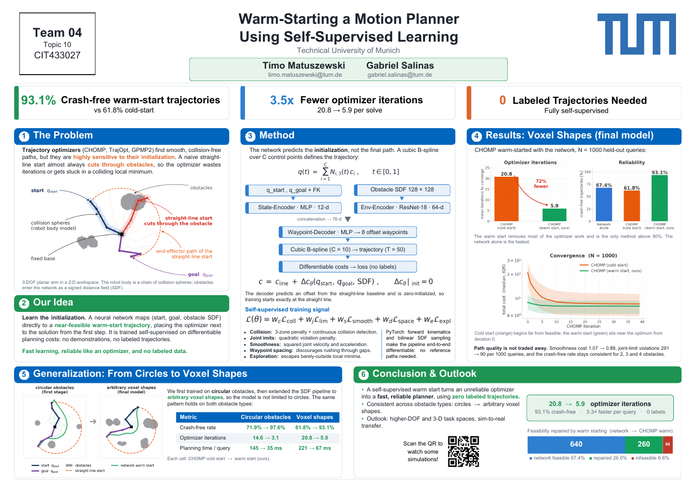
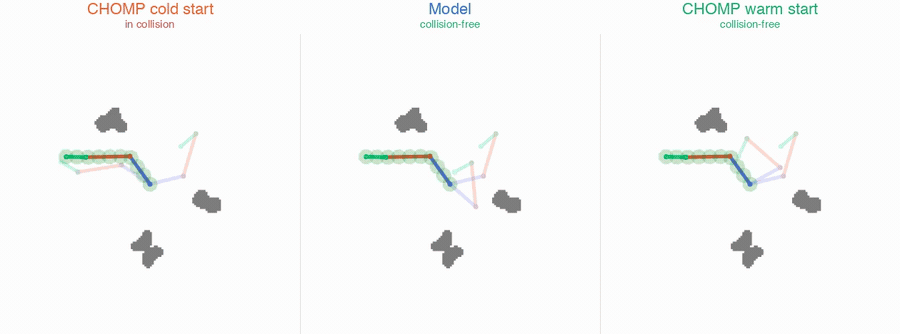
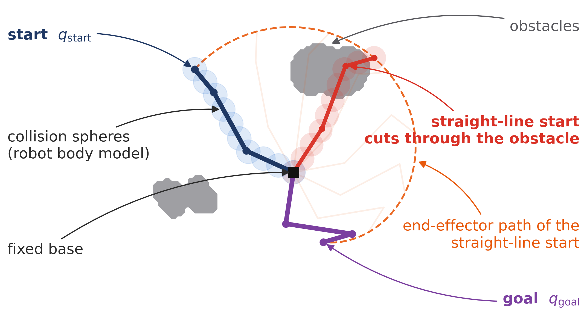
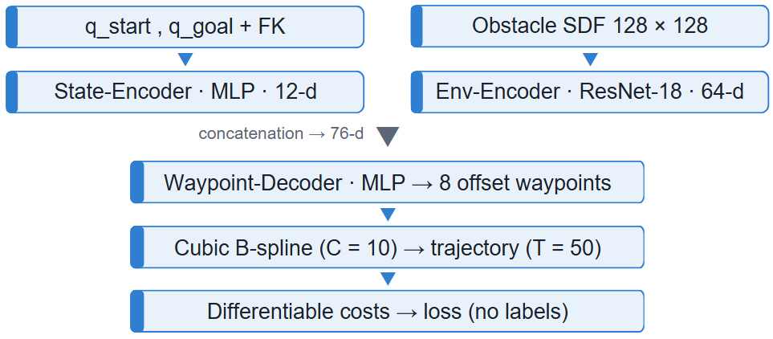
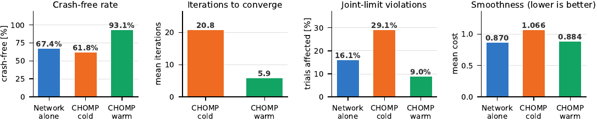
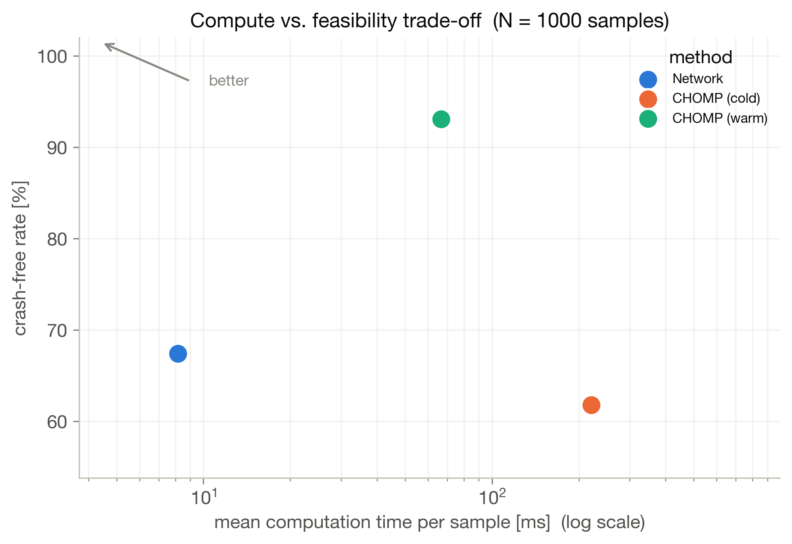
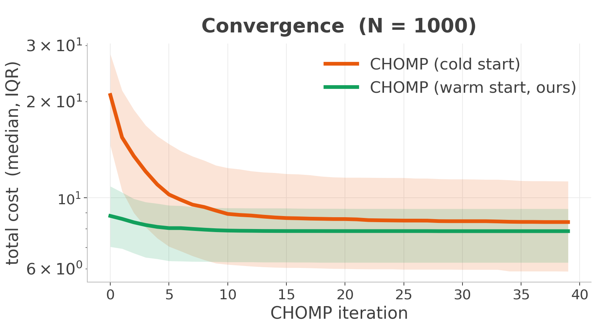
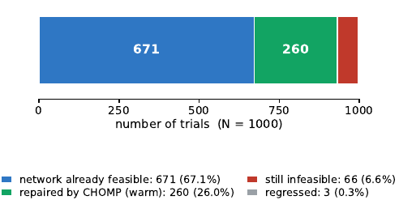
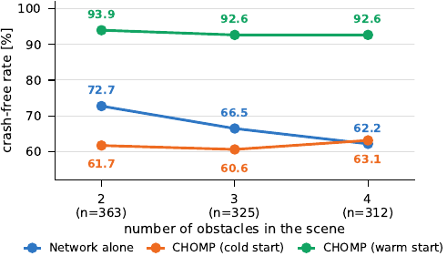
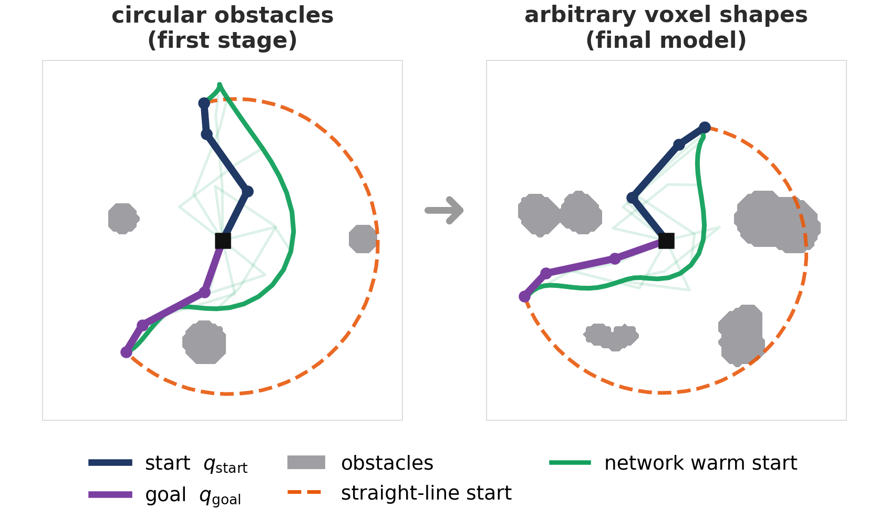

# Warm-Starting a Motion Planner using Self-Supervised Learning

> **Neural warm-starts for robot motion planning. No labeled trajectories needed.**


**A neural network predicts a near-feasible trajectory in ~8 ms; CHOMP then refines it to feasibility.
On 1000 held-out problems with irregular, non-convex obstacles this raises the collision-free rate
from 61.8 % to 93.1 %, cuts the mean optimizer iterations from 20.8 to 5.9, and the planning time per
query from 221 ms to 67 ms. The network is trained end-to-end on the optimizer's own differentiable
costs, with no expert demonstrations and no labels of any kind.**

*Timo Matuszewski · Gabriel Salinas, Technical University of Munich*

---

## Project Documents

| | Document | |
|---|---|---|
| 📘 | **[Report](docs/Report.pdf)** | Final paper, IEEE format, 5 pages |
| 🖼️ | **[Poster](docs/Poster-Presentation.pdf)** | Poster session, single page |
| 🖥️ | **[Midterm Presentation](docs/Midterm-Presentation.pdf)** | Mid-semester status, 11 slides |
| 📄 | **[Project Proposal](docs/Project-Proposal.pdf)** | Initial proposal, 2 pages |

<a href="docs/Poster-Presentation.pdf">
  
</a>

---

## Demo

One planning problem, three methods side by side. **CHOMP from a cold start** grinds through many
iterations and still ends in a colliding local minimum; the **network alone** produces a clean path in
a single forward pass; **CHOMP warm-started from the network** converges in a few iterations to a
feasible solution. The panel subtitles report the feasibility verdict per method.



<sub>Voxel shape dataset, final model. Full-resolution MP4:
[shapes_compare_sample_30.mp4](docs/videos/shapes_compare_sample_30.mp4), regenerated by
`src/create_comparison_videos.ipynb`.</sub>

---

## Overview

Trajectory optimizers such as CHOMP, STOMP and TrajOpt return smooth, kinematically consistent paths
at a low per-iteration cost, but the objective they minimize is strongly non-convex. They only ever
find a local minimum, so the outcome is governed less by the optimizer than by **where it is
started**. The default initialization is a straight line in configuration space, which in a cluttered
workspace almost always sweeps the robot body through an obstacle.

<p align="center">
  
</p>

| Approach | Speed | Reliability | Requires |
|---|---|---|---|
| Classical optimization (cold start) | Slow | Medium | Good initialization |
| Pure learning-based | Fast | Low at distribution shift | Large labeled dataset |
| **This project (learned warm start + CHOMP)** | **Fast** | **High** | **No labeled data** |

Learning the initialization is a natural remedy, but supervised warm-starting comes with a **dataset
bottleneck**: expert trajectories must first be produced by a classical planner, which is expensive,
and the learner inherits the expert's biases.

Our starting point is that the objective a trajectory optimizer minimizes is **already differentiable**
with respect to the trajectory. Rather than imitating an expert, we backpropagate that same objective
directly into a network that outputs the initialization, so the label set is empty. Crucially, the
network is not asked to solve the planning problem. It only has to land inside the basin of attraction
of a feasible minimum; the classical optimizer then verifies the result and repairs it where
necessary, which keeps the guarantees of the classical stage while removing most of its work.

---

## Method

```
  Start/Goal Config + Obstacle Environment (SDF)
                       |
                       v
          +------------------------+
          |  Neural Warm-Start     |   ~8 ms, no optimization
          |  Predictor             |
          +------------------------+
                       |
                       v
          Near-feasible trajectory
          (cubic B-spline, T=50 steps)
                       |
                       v
          +------------------------+
          |  CHOMP Refinement      |   ~6 iterations, median 1
          |  (same cost terms)     |
          +------------------------+
                       |
                       v
          Collision-free trajectory
```

### Neural Architecture

<p align="center">
  
</p>

**Environment encoder.** A **ResNet-18** (`torchvision`, no pretrained weights) whose first
convolution is replaced by a single-channel `7x7/2` conv so it consumes the raw `[1, 128, 128]` SDF
directly. Global average pooling feeds a linear `512 -> 64` layer. The residual backbone was needed
because the earlier shallow CNN could not resolve narrow passages between obstacles.

**State encoder.** A 3-layer MLP (`22 -> 128 -> 128 -> 12`) over
`[q_start, q_goal, FK(q_start), FK(q_goal)]`. The deliberately tight 12-d latent keeps the environment
code (64-d) dominant in the concatenation, so the decoder conditions primarily on obstacle layout.

**Waypoint decoder.** An MLP (`76 -> 256 -> 256 -> 24`) predicting `(C-2) x dof = 24` values.
Crucially it predicts **offsets from a straight-line baseline**, not absolute waypoints, and its
output layer is **zero-initialized**, so an untrained model reproduces the straight-line interpolation
exactly and training starts from a sensible baseline rather than random noise. Endpoints are
concatenated, never predicted, so start and goal are satisfied by construction.

**Pre-training.** Both encoders are pre-trained as autoencoders (20 000 SDF maps, 240 000
configuration pairs) and then **frozen**, so the self-supervised trajectory loss only shapes the
decoder.

<details>
<summary>Same architecture with tensor shapes</summary>

```
  q_start, q_goal  (2 x 3)              SDF map (1 x 128 x 128)
        |                                        |
        v                                        v
  state features [q_s, q_g, FK_s, FK_g]    EnvEncoder
  22-d                                     ResNet-18 backbone
        |                                  (conv1 -> 1 channel)
        v                                  avgpool -> fc 512->64
  StateEncoder (MLP 22-128-128-12)               |
        |                                        |
        +-------------------+--------------------+
                            |  concat -> 76-d
                            v
                  WaypointDecoder (MLP 76-256-256-24)
                  zero-initialized output layer
                            |
                            v
                  offsets for C-2 = 8 interior waypoints
                            |
                  + linear interpolation baseline
                  prepend q_start · append q_goal
                            |
                            v
              waypoints [B, C=10, dof=3]
                            |
              B-spline matrix M [T=50, C=10]
                            |
                            v
              trajectory [B, T=50, dof=3]
                            |
              Differentiable Cost Functions
               collision · limits · smoothness
               spacing · exploration
                            |
                            v
                     Loss -> Backprop
```

</details>

### Self-Supervised Training

Trajectories are parameterized as **cubic B-splines**: the network predicts `C = 10` control points in
joint space (8 interior; start and goal fixed), evaluated to a `T = 50`-step trajectory via the
Cox-de Boor recursion. No reference trajectories are used. The model is trained by minimizing a
composite differentiable cost over that spline:

| Cost term | Description |
|---|---|
| **Collision** | Three-zone penalty (inside / danger zone / safe) plus exponential repulsion and self-collision avoidance; CCD inflation prevents tunneling through thin obstacles |
| **Joint limits** | Quadratic hinge penalty for joint angle violations |
| **Smoothness** | Penalizes squared joint velocities over circular differences |
| **Waypoint spacing** | Penalizes unequal spacing between control points to discourage rushing through narrow passages |
| **Exploration** | Forces trajectory deviation whenever the arm is in collision, breaking the "barely outside the obstacle" local minimum |

The robot body is approximated by **spheres** along each link. Forward kinematics is implemented in
PyTorch and sphere-to-obstacle distances come from **bilinear interpolation** on the SDF grid, so
gradients flow from sphere world positions back through joint angles into the network weights.

### CHOMP Refinement

`chomp.py` implements CHOMP on top of the **same** `losses.py` terms the network is trained on, so the
learned and classical stages pursue an identical objective. It minimizes
`U(ξ) = collision + joint_limits + smoothness` over a dense trajectory with the *covariant* update

```
ξ_{k+1} = ξ_k - (1/η) * A⁻¹ ∇U(ξ_k),      A = KᵀK   (K = second-difference operator)
```

so a change at one waypoint is spread smoothly over its neighbours. Start and goal are pinned. Four
implementation notes that mattered in practice:

- **Backtracking line search.** A fixed `1/η` step overshoots on this stiff cost and can leave a warm-started trajectory *worse* than it began. The step is halved until the cost actually decreases. `η` therefore caps the largest step considered, not the step taken.
- **Convergence-based stopping**, not a fixed iteration count: collision-free, cost plateau, or `max_iters`. This is what makes wall-clock time a meaningful quantity to compare.
- **`collision_agg="sum"`** for optimization. Training aggregates with `max` (worst timestep only), which carries gradient through a single waypoint and stalls a trajectory optimizer.
- **Warm starts** accept the model's control points directly, lifted through the same clamped B-spline matrix the model uses (cached per `C`, because rebuilding it costs ~75 ms and dwarfed the optimization itself).

---

## Results

Two models, each benchmarked on **1000 held-out test problems** from its own distribution. Both use
the same robot (3 revolute joints, links `[0.35, 0.45, 0.20]` m, 10 collision spheres of radius
0.08 m, limits `±0.9π` rad, 2.5 m workspace on a 128×128 SDF grid). Only the obstacles differ:

- **Circular obstacles** (`wsp_general_0907_v1`): 1-3 circles, radii 0.06-0.18 m. First development stage.
- **Voxel shapes** (`wsp_general_shapes_1707_v1`): 2-4 irregular, non-convex obstacles from harmonic surface perturbation and inward directional crushing, sizes 0.15-0.30 m. Substantially harder. **This is the final model.**

Start/goal pairs are kept **only if the straight line between them intersects an obstacle**, giving
10 000 non-trivial problems per distribution. Every CHOMP variant is given the corresponding model's
own training loss weights, and all methods are scored by the same weight-independent criterion (see
[Methodology](#benchmark-methodology)).

### Headline numbers

**Voxel shapes (final model)**

| Method | Collision-free | Mean iters | ms / query |
|---|---|---|---|
| Network only | 67.4 % | n/a | **8.2** |
| CHOMP (cold) | 61.8 % | 20.8 | 220.9 |
| **Network → CHOMP (warm)** | **93.1 %** | **5.9** | 66.6 |

**Circular obstacles (first stage)**

| Method | Collision-free | Mean iters | ms / query |
|---|---|---|---|
| Network only | 86.3 % | n/a | **9.1** |
| CHOMP (cold) | 71.9 % | 14.6 | 144.6 |
| **Network → CHOMP (warm)** | **97.6 %** | **3.1** | 35.0 |

<p align="center">
  
</p>

Warm starting improves all four metrics at once: it is the most reliable method, converges in a
fraction of the iterations, respects the joint limits on more trials than either baseline, and is as
smooth as the network's own output.

This is the non-obvious part. A learned initialization is usually understood as a way of buying speed,
and one would expect to pay for it in solution quality. Here there is no tradeoff, because the network
is not adding work in front of the optimizer but removing work from it. Notably, cold CHOMP ends up
*below* the network alone on both distributions (61.8 % vs. 67.4 %, and 71.9 % vs. 86.3 %) while
costing 16 to 27 times the computation: it converges into colliding local minima, precisely the
failure mode the warm start is designed to avoid.

<table>
  <tr>
    <td align="center"><b>Speed vs. feasibility (voxel shapes)</b></td>
    <td align="center"><b>Convergence: warm vs. cold</b></td>
  </tr>
  <tr>
    <td></td>
    <td></td>
  </tr>
</table>

The warm start begins at a cost the cold start only reaches after roughly ten iterations, and its
median converges below the level the cold start plateaus at, so the two are not descending into the
same minima.

### Where the improvement comes from

The averages hide a strongly bimodal distribution, so the mean of 5.9 iterations does not describe a
typical run. Splitting the 1000 voxel problems by whether the network alone already solved them yields
two regimes: on the 674 problems (67.4 %) it solves, the optimizer only has to refine an
initialization that already lies in the basin of a feasible minimum, whereas the remaining 326 demand
substantially more work.

<p align="center">
  
</p>

For those 326 problems the warm start is decisive: it repairs 260 of them (79.8 %), whereas cold CHOMP
solves only 140 (42.9 %) of the same subset. The optimizer, the cost weights and the time budget are
identical; the only difference is the initialization. It is therefore the initialization, not the
optimizer, that is doing the work. Three feasible trajectories regress and 66 remain infeasible, which
accounts for the residual 6.9 % failure rate. The circular set gives 118 of 137 repaired (86.1 %)
versus 80 (58.4 %) cold.

### Path quality is not traded away

Higher feasibility at lower cost would be a poor deal if it were paid for with erratic trajectories.
Escaping a collision from a bad initialization means swinging the arm far, and cold CHOMP leaves the
feasible joint range to do so:

| Metric (voxel shapes) | Network | CHOMP (cold) | CHOMP (warm) |
|---|---|---|---|
| Trials violating joint limits | 16.1 % | 29.1 % | **9.0 %** |
| Max joint violation | n/a | up to 3.00 rad | n/a |
| Mean min. clearance | n/a | **-0.029 m** | **+0.030 m** |
| Smoothness cost (mean, lower better) | **0.870** | 1.066 | 0.884 |

Cold CHOMP's mean minimum clearance of -0.029 m puts the average cold solution *inside* the safety
margin, whereas the warm-started one keeps +0.030 m. The network never learned the erratic behavior in
the first place, and warm-starting inherits that.

### Robustness and generalization

<table>
  <tr>
    <td></td>
    <td></td>
  </tr>
</table>

Split by scene difficulty, the warm-started pipeline stays **essentially flat**: 93.9 %, 92.6 % and
92.6 % for 2, 3 and 4 obstacles, whereas the network alone degrades from 72.7 % to 62.2 %. The
optimizer absorbs the difficulty the learned representation cannot, and the combined pipeline is the
only one whose reliability does not depend on how crowded the scene is.

The pipeline was first developed on circular obstacles and then transferred to arbitrary voxel shapes
by **exchanging only the dataset**, leaving architecture, losses and training protocol untouched. The
learned representation is a signed distance field rather than a parametric obstacle list, so nothing
in the model is specific to circles.

### Ablation and limitations

Giving the optimizer the exploration and waypoint-spacing terms the *network* is trained with is
neutral on feasibility (93.1 % → 93.3 %, 97.6 % → 97.6 %) at 1.5 to 2.2× the wall-clock time, and it
destabilizes a cold start badly (worst-case smoothness 89.7 versus 3.6). These terms earn their place
during training, but not as per-problem search aids.

- **Timings are CPU, single sample** (`device="cpu"`, B=1), so they report per-problem latency rather than throughput. Batched GPU inference would widen the network's advantage.
- **Warm CHOMP occasionally regresses an already feasible trajectory** (3 and 5 trials), because the line search guarantees monotone descent in *cost* and a cheaper trajectory can be marginally in collision.
- **Mean times understate the tail.** On voxel shapes the network runs 8.1 ms median / 8.5 ms p95, warm CHOMP 18.5 / 332.5 ms, cold CHOMP 109.6 / 646.8 ms. The network is fast *and* predictable; warm CHOMP keeps a heavy tail on the hard minority, which is where the remaining failures live.
- **The two runs use different obstacle distributions** and are not directly comparable to each other; only the methods within a run are.

### Benchmark methodology

Two choices keep the comparison honest:

1. **CHOMP is given the loaded model's own loss weights**, not `chomp.py`'s defaults. Otherwise the model would compete against an optimizer chasing a different objective.
2. **Scoring is weight-independent.** A trajectory counts as *crash-free* only if the **surfaces** of all 10 collision spheres stay clear of every obstacle at all 50 timesteps, the same criterion `data.is_collision_free` uses to build the dataset. CHOMP runs to convergence rather than a fixed iteration count, which is what makes wall-clock time meaningful.

Full figure sets, `summary.csv` and a `results.pkl` from which every figure can be regenerated without
re-running CHOMP are exported to `src/resources/results_general_0907_v1/` and
`src/resources/results_general_shapes_1707_v1/`.

---

## Repository Structure

```
Self-Supervised-Learning-for-Robot-Motion-Planning/
|
+-- docs/                            # Course deliverables
|   +-- Report.pdf
|   +-- Poster-Presentation.pdf
|   +-- Midterm-Presentation.pdf
|   +-- Project-Proposal.pdf
|   +-- figures/                     # Figures shared by the report and this README
|   +-- videos/                      # Three-way comparison videos (MP4 + GIF)
|
+-- src/
|   +-- models.py                    # WarmStartPlanner, encoders, B-spline utilities
|   +-- losses.py                    # Differentiable cost functions
|   +-- training.py                  # Training loops for planner and autoencoders
|   +-- chomp.py                     # CHOMP optimizer (cold start and warm start)
|   +-- evaluation.py                # Weight-independent trajectory metrics
|   +-- utils.py                     # Forward kinematics, sphere FK, differentiable SDF query
|   +-- data.py                      # Dataset generation (circles), SDF building, dataset browser
|   +-- data_shapes.py               # Dataset generation with irregular voxel obstacles
|   +-- visualization.py             # Trajectory browser, GIF export
|   +-- visualization_shapes.py      # Same, for voxel-shape datasets
|   |
|   +-- training_circles.ipynb       # End-to-end pipeline, circular obstacles (wsp_general_0907_v1)
|   +-- training_shapes.ipynb        # End-to-end pipeline, voxel shapes (wsp_general_shapes_1707_v1)
|   +-- chomp_test.ipynb             # CHOMP tests, full benchmark, report figures
|   +-- create_comparison_videos.ipynb  # Side-by-side cold / network / warm videos
|   +-- old_create_training_data.ipynb  # Earlier dataset generation (circles)
|   +-- old_train.ipynb              # Earlier training and overfitting experiments
|   +-- old_test.ipynb               # Earlier cost inspection and visualization
|   |
|   +-- models/                      # Saved model weights (.pt, via Git LFS)
|   +-- data/                        # Generated datasets (.pt, not tracked)
|   +-- resources/                   # Result figure sets, GIFs, cost plots
|
+-- external/
|   +-- SimpleArm/                   # Git submodule: 2D planar arm simulator
|
+-- requirements.txt
+-- README.md
```

`data.py` / `visualization.py` handle the original **circular-obstacle** datasets; `data_shapes.py` /
`visualization_shapes.py` are the parallel versions for the **voxel-shape** datasets (`*_shapes_*`),
which additionally store the true voxel occupancy so the renderer draws the actual shapes rather than
the seed circles. `models.py`, `losses.py`, `training.py`, `chomp.py`, `evaluation.py` and `utils.py`
are shared by both. All notebooks assume `src/` as the working directory.

---

## Installation

Requires **Python 3.11** and Git with submodule support.

```bash
# 1. Clone repository with submodule (model weights are tracked with Git LFS)
git lfs install
git clone --recurse-submodules https://github.com/mangam-02/Self-Supervised-Learning-for-Robot-Motion-Planning.git
cd Self-Supervised-Learning-for-Robot-Motion-Planning

# 2. Create and activate a virtual environment
python3.11 -m venv .venv
source .venv/bin/activate          # macOS / Linux
# .venv\Scripts\activate           # Windows

# 3. Install dependencies
pip install -r requirements.txt
```

If you cloned without `--recurse-submodules`, run `git submodule update --init --recursive`.

`SimpleArm` is not installed into the environment. Every module expects it on `sys.path`, which the
notebooks do in their setup cell:

```python
import sys, os
sys.path.insert(0, os.path.abspath("../external/SimpleArm/src"))
```

| Problem | Fix |
|---|---|
| `python3.11: command not found` | `brew link python@3.11 --force` (macOS) or use `python3` |
| `ModuleNotFoundError: simplearm` | The `sys.path.insert` line above is missing, or the submodule was not initialized |
| `pip install` fails | `pip install --upgrade pip && pip cache purge` |

---

## Conclusion

A trajectory optimizer can be warm-started by a neural network trained without a single labeled
trajectory, by backpropagating the planner's own differentiable cost into the network that produces
its initialization. On non-convex obstacle scenes this yields 93.1 % versus 61.8 % crash-free
trajectories at 5.9 instead of 20.8 iterations per query. The decomposition of that number is the more
interesting finding: the warm start does not make the optimizer better at descending, it removes most
of its work on two thirds of the queries and moves the remaining third into a basin from which it
succeeds nearly twice as often as from a straight line.

**Future work.** The self-supervised signal is dimension-agnostic, so the obvious next step is a
higher-DOF arm in a 3D workspace, where the payoff of removing expert data is far larger. Fine-tuning
the frozen encoders should recover part of the 32.6 % of queries the network alone still fails, and
predicting a diverse set of warm starts instead of one would cover several homotopy classes at once.

---

## References

1. N. Ratliff, M. Zucker, J. A. Bagnell, S. Srinivasa. **CHOMP: Gradient optimization techniques for efficient motion planning.** ICRA, 2009.
2. M. Kalakrishnan, S. Chitta, E. Theodorou, P. Pastor, S. Schaal. **STOMP: Stochastic trajectory optimization for motion planning.** ICRA, 2011.
3. J. Schulman et al. **Finding locally optimal, collision-free trajectories with sequential convex optimization.** IJRR 33(9), 1251-1270, 2014.
4. J. Tenhumberg, D. Burschka, B. Bäuml. **Speeding up optimization-based motion planning through deep learning.** arXiv:2311.08345, 2023.
5. A. H. Qureshi, Y. Miao, A. Simeonov, M. C. Yip. **Motion planning networks.** ICRA, 2019.
6. Y. Xie et al. **Efficient learning of fast inverse kinematics with collision avoidance.** arXiv:2311.05938, 2023.

---

*Course project: **Advanced Deep Learning for Robotics** (SS26), Prof. Berthold Bäuml,
Technical University of Munich.*
